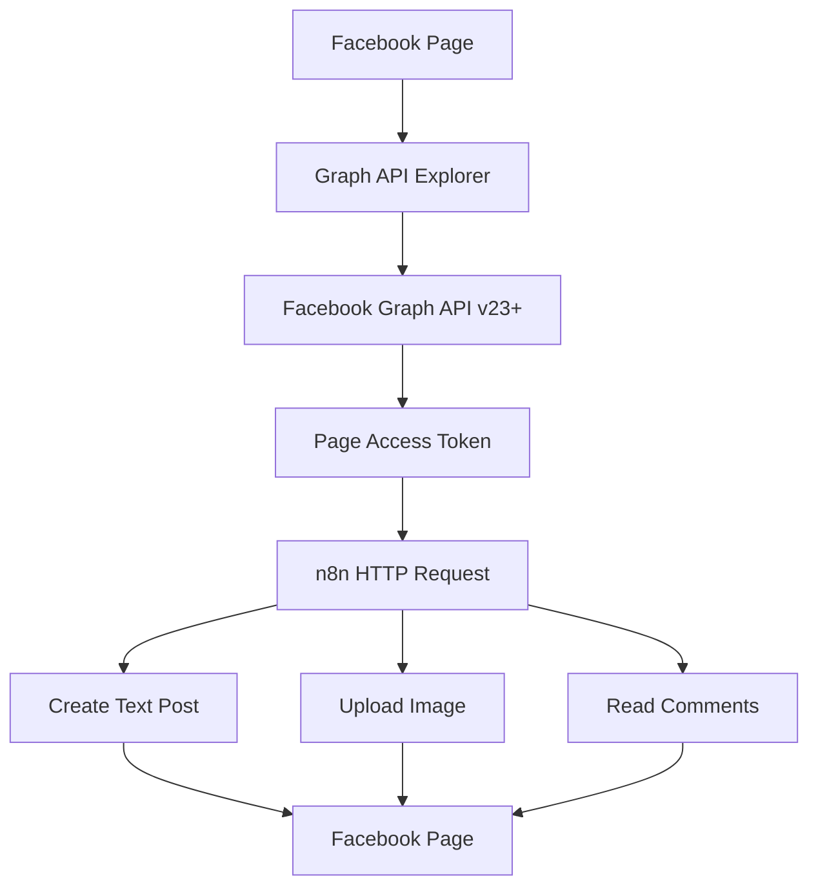

# Incident2Insight

Automation knowledge base and reusable workflows.

---

## Facebook Automation

### Architecture
                           FACEBOOK PAGE                                                
                                  │
                                  │
                         Graph API Explorer
                                  │
                                  ▼
                      Facebook Graph API v23+
                                  │
                    Page Access Token (OAuth)
                                  │
                                  ▼
                      n8n HTTP Request Node
                                  │
          ┌───────────────────────┼───────────────────────┐
          │                       │                       │
          ▼                       ▼                       ▼
      Create Post            Upload Image          Read Comments
          │                       │                       │
          └───────────────────────┼───────────────────────┘
                                  │
                                  ▼
                           Facebook Page

🏗️ Architecture

### Documentation
- [Facebook Page API n8n Setup Guide](docs/facebook-page-api-n8n-setup-guide.md)
- [Facebook API Cookbook](docs/facebook-api-cookbook.md)
- [Facebook Troubleshooting](docs/facebook-troubleshooting.md)

### n8n Examples
- [Post Text](examples/Post_Text.json)
- [Upload Image](examples/Upload_Image.json)
- [Read Comments](examples/Read_Comments.json)
- [Get Insights](examples/Get_Insights.json)

### Images
Screenshots used in the documentation.

### Workflows
Reusable n8n workflows ready to import.
